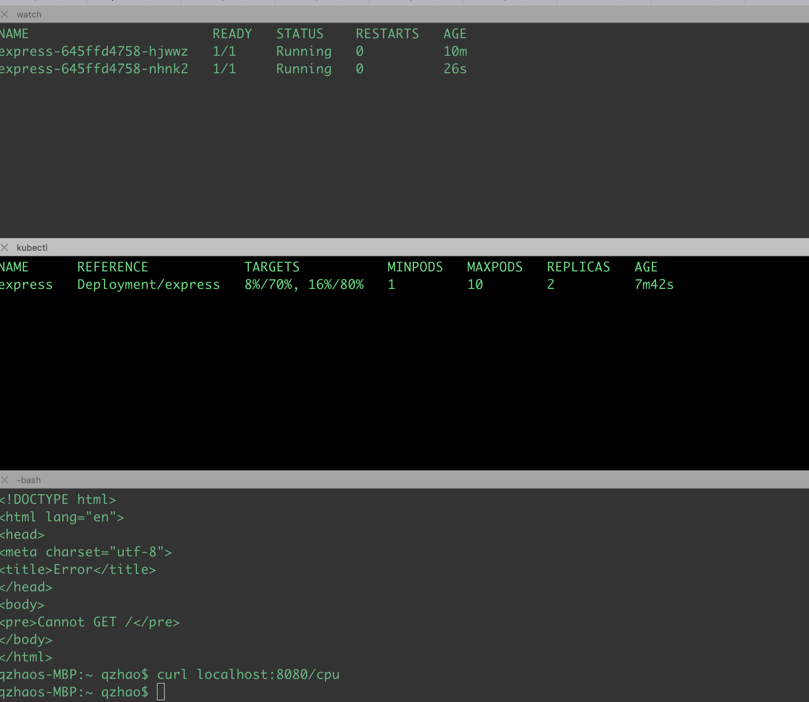

```
 eksctl create/delete cluster -f eks.yaml
```
```
 aws eks update-kubeconfig --name qzhao
```
```
kubectl apply -f k8s/0-metrics-server.yaml

kubectl logs -l k8s-app=metrics-server -n kube-system -f


watch -n 1 -t kubectl get pods
watch -n 1 -t kubectl get hpa
kubectl get pods
kubectl port-forward express-645ffd4758-hjwwz 8080

curl localhost:8080/cpu
```

